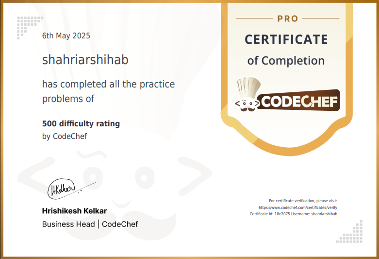

# 🧠 CodeChef 300 to 500 Rating Problems – Curated Problem-Solving Collection

Welcome to a curated collection of **CodeChef problems ranging from 300 to 500 difficulty rating**.  
Over the course of **4 intense days**, I solved a total of **115 problems**—starting from 200-rated ones to build momentum.  
However, this repository exclusively focuses on **problems that fall within the 300–500 difficulty range**, offering a solid foundation for anyone seeking to strengthen their logic, coding precision, and problem-solving mindset.

---

## 🏅 Certification Milestone

On **6th May 2025**, I was awarded the **CodeChef Certificate of Completion** for solving all problems under the 500 difficulty rating.  
This milestone reflects my initial push toward mastering the fundamentals of competitive programming and creating a consistent problem-solving habit.

---

## 💡 About This Collection

This repository is intended as a **learning resource** and **self-assessment archive**. Every problem in this collection has been:

- Thoughtfully selected from the 300–500 range
- Solved with clarity and simplicity in mind
- Written with clean, understandable code for others to follow

---

## 🎯 Purpose and Focus

The goal of this project is to:

- Develop strong foundational skills in algorithmic thinking
- Prepare for higher-rated challenges by mastering the essentials
- Provide others with a clean and useful reference for learning problems in the 300–500 rating zone

Whether you're a beginner starting out or someone revisiting fundamentals, this collection aims to serve as a useful guide.

---

> **Note:** The certificate above acknowledges the full range (including 200–300), but this repository is exclusively limited to **300–500** rating problems for relevance and focus.
